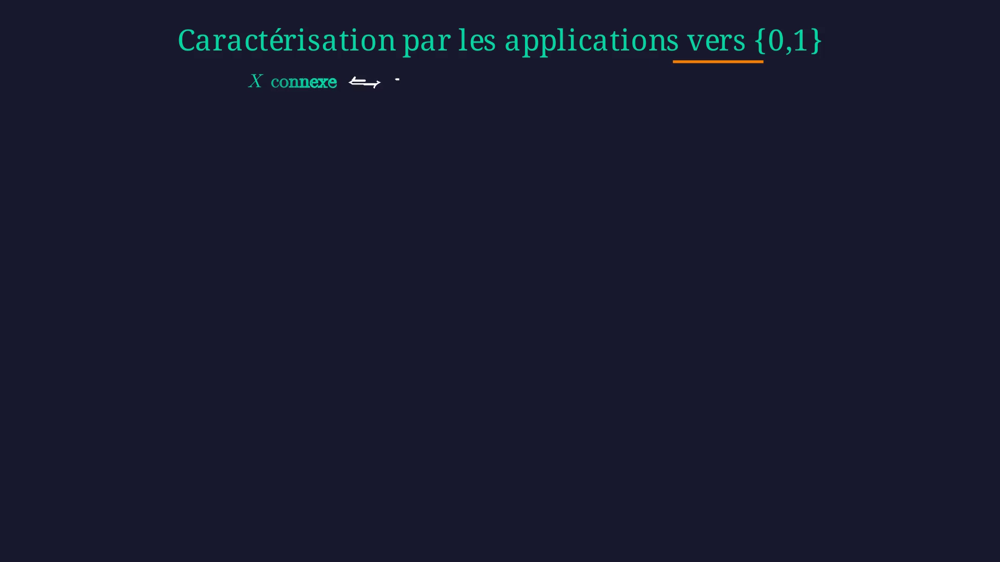
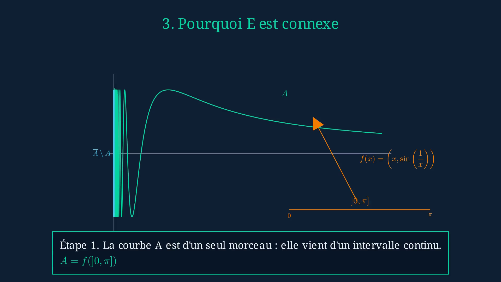
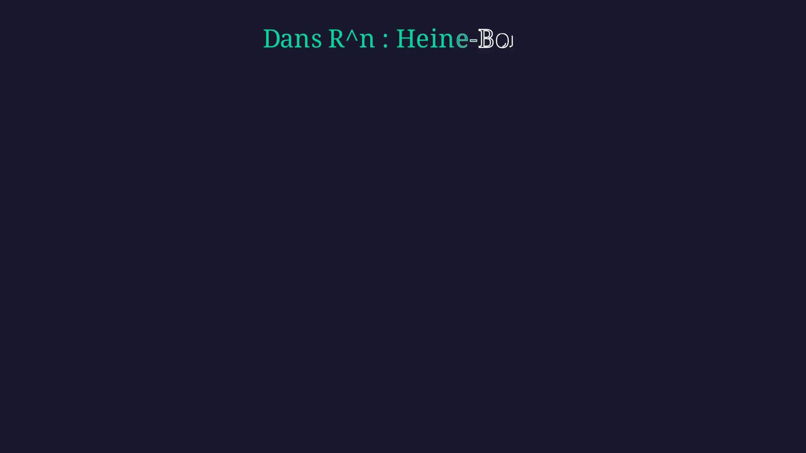

# topo-manim

> Animations Manim pour illustrer le cours de topologie de L3 — Sorbonne Université.


**Référence principale :** *Mémo de topologie*, Frédéric Le Roux & Frédéric Klopp,
[SU 3M260, 2021](references/3M260-memoTOP-2021.pdf)
**Encadrant :** Frédéric Le Roux
**Outil :** [Manim Community Edition](https://www.manim.community/)

---

## Sommaire

- [Présentation](#présentation)
- [Vidéos](#vidéos)
- [Structure du projet](#structure-du-projet)
- [Installation](#installation)
- [Utilisation](#utilisation)
- [Contenu mathématique](#contenu-mathématique)
- [Documentation et références](#documentation-et-références)
- [Changelog](#changelog)
- [Roadmap](#roadmap)
- [Licence](#licence)

---

## Présentation

Ce projet construit des **scènes Manim courtes et réutilisables** pour visualiser
les notions abstraites du cours de topologie métrique de L3 :

- **Connexité** et connexité par arcs
- **Compacité** et recouvrements ouverts
- **Complétude** et théorème de Baire

Le code suit fidèlement le formalisme du *Mémo de topologie* de F. Le Roux et
F. Klopp : énoncés, notations, ordre des sections et recettes de preuves sont
alignés sur le PDF du cours fourni dans [`references/`](references/).

L'organisation est en deux couches :

| Dossier      | Rôle                                                            |
|--------------|-----------------------------------------------------------------|
| `src/`       | Briques réutilisables : objets topologiques, animations, utils. |
| `scenes/`    | Scènes finales prêtes au rendu, organisées par chapitre.        |

---

## Vidéos

Trois scènes ont été rendues en **1920×1080**. Cliquez sur la miniature pour
ouvrir la vidéo correspondante.

### 1. ConnexeVsArcs — *Connexité par arcs vs connexité topologique*

> Définit la connexité par arcs et la connexité, prouve rigoureusement
> `c.p.a. ⟹ connexe` par contraposition selon la *recette du cours*, et
> introduit le contre-exemple `sin(1/x)` pour la réciproque.
> **Durée :** 3 min 56 — **Résolution :** 1920×1080@30fps — **Taille :** 9.7 MB

[](videos/ConnexeVsArcs.mp4)

### 2. ContreExempleSin1x — *Contre-exemple `sin(1/x)`*

> Construit progressivement le graphe `{(x, sin(1/x)) : x > 0} ∪ {0}×[-1,1]`,
> zoom infini sur l'origine, démontre que `E` est connexe (adhérence d'un connexe
> par arcs) mais n'est pas connexe par arcs (l'argument du *coureur topologique*).
> **Durée :** 1 min 47 — **Résolution :** 1920×1080@60fps — **Taille :** 7.5 MB

[](videos/ContreExempleSin1x.mp4)

### 3. BorelLebesgue — *Compacité et théorème de Borel-Lebesgue*

> Présente la compacité séquentielle, le théorème de Borel-Lebesgue
> (*tout recouvrement ouvert admet un sous-recouvrement fini*), Heine-Borel
> dans `ℝⁿ`, le contre-exemple `]0,1]` et le lemme de Lebesgue.
> **Durée :** 1 min 01 — **Résolution :** 1920×1080@30fps — **Taille :** 2.4 MB

[](videos/BorelLebesgue.mp4)

> [!NOTE]
> Les scènes `InvarianceTopologique` et `Baire` ne sont pas encore rendues
> en 1080p — voir [Roadmap](#roadmap).

---

## Structure du projet

```text
topo-manim/
├── src/                          # Briques réutilisables
│   ├── animations/
│   │   ├── continuity.py         # ε-δ, image réciproque d'ouverts
│   │   ├── convergence.py        # suites convergentes
│   │   └── deformations.py       # déformations continues, homéomorphismes
│   ├── objects/
│   │   ├── coverings.py          # recouvrements ouverts
│   │   ├── metric_space.py       # espaces métriques génériques
│   │   ├── paths.py              # chemins, arcs, concaténation
│   │   ├── presentation.py       # primitives visuelles (glow, panneaux)
│   │   └── topological_set.py    # ouverts, fermés, intérieur, adhérence
│   ├── utils/
│   │   ├── colors.py             # palette sémantique partagée
│   │   ├── layout.py             # positionnement et annotations
│   │   └── tex_labels.py         # labels LaTeX standardisés
│   └── config.py                 # config Manim (1920×1080, fond sombre)
│
├── scenes/                       # Scènes finales par chapitre
│   ├── 01_connexite/
│   │   ├── connexe_vs_arcs.py            (1637 lignes)
│   │   ├── contre_exemple_sin1x.py       (834 lignes)
│   │   └── invariance_topologique.py     (242 lignes)
│   ├── 02_compacite/
│   │   └── borel_lebesgue.py             (278 lignes)
│   └── 03_completude/
│       └── baire.py                      (232 lignes)
│
├── tests/                        # Tests d'import des scènes
│   └── test_scene_imports.py
│
├── videos/                       # Vidéos finales (1080p) ← suivies par git
│   ├── ConnexeVsArcs.mp4
│   ├── ContreExempleSin1x.mp4
│   ├── BorelLebesgue.mp4
│   └── thumbnails/               # Miniatures PNG pour le README
│
├── references/                   # Documents de cours
│   └── 3M260-memoTOP-2021.pdf    # Mémo de topologie (Le Roux/Klopp)
│
├── Latex/Rapports/               # Rapport de stage
│   ├── Rapport.tex
│   └── Rapport.pdf
│
├── media/                        # Rendus de travail Manim (gitignored)
│
├── Makefile                      # Cibles de rendu et de test
├── pyproject.toml                # Dépendances (manim, numpy, pytest)
└── README.md
```

---

## Installation

### Prérequis système (Fedora)

Manim a besoin de FFmpeg, Cairo, Pango et LaTeX :

```bash
sudo dnf install -y cairo-devel pango-devel pkgconf-pkg-config python3-devel \
                    ffmpeg-free-devel texlive-scheme-medium
```

### Installation Python via `uv`

```bash
# Installer uv si besoin
curl -LsSf https://astral.sh/uv/install.sh | sh

# Cloner le projet et synchroniser l'environnement
git clone <url-du-repo> topo-manim
cd topo-manim
uv sync
```

ou via le Makefile :

```bash
make install
```

---

## Utilisation

### Rendre une scène individuelle

```bash
make connexe_vs_arcs                    # qualité basse (-ql, ~480p, rapide)
make connexe_vs_arcs QUALITY=-qh        # qualité haute (-qh, 1080p)
make borel_lebesgue
make baire
make sin1x
make invariance
```

ou directement :

```bash
PYTHONPATH=. uv run manim render -qh scenes/01_connexite/connexe_vs_arcs.py ConnexeVsArcs
```

### Rendre toutes les scènes

```bash
make all                # toutes les scènes en qualité basse
make hq                 # toutes les scènes en qualité haute (1080p)
```

### Tests

```bash
make test               # vérifie que toutes les scènes s'importent
make check              # vérification syntaxique (compileall)
```

### Nettoyage

```bash
make clean              # supprime media/
```

---

## Contenu mathématique

L'organisation des scènes suit l'ordre du *Mémo de topologie* (Le Roux/Klopp 3M260) :

### Chapitre IV — Connexité

| Scène                     | Sections du cours couvertes                                                          | Durée  |
|---------------------------|--------------------------------------------------------------------------------------|--------|
| `ConnexeVsArcs`           | § IV.1.(a) connexité par arcs, § IV.1.(c) connexité, corollaire c.p.a. ⟹ connexe    | 3:56   |
| `ContreExempleSin1x`      | § IV.2.(a) contre-exemple à la réciproque                                             | 1:47   |
| `InvarianceTopologique`   | Corollaire IV.2 — invariance topologique                                              | —      |

**Détail de `ConnexeVsArcs` (suit fidèlement le cours) :**

1. **Ouverture** — la question intuitive
2. **§ IV.1.(a) Connexité par arcs** — chemin γ : [0,1] → X, exemple ℝᴺ via
   γ(t) = (1-t)x₀ + tx₁, **Proposition IV.1** (image continue, réunion à
   point commun, produit fini), **Corollaire IV.2**, concaténation γ ⋆ γ'
3. **§ IV.1.(c) Connexité** — définition primaire par les ouverts-fermés,
   proposition équivalente : X non connexe ⟺ ∃ X = O ⊔ O' partition en
   ouverts non vides
4. **Caractérisation par les applications vers {0,1}** — exercice 88 du
   cours sur les applications localement constantes, équivalence
   X connexe ⟺ toute f : X → {0,1} continue est constante, **corollaire
   [0,1] est connexe**
5. **Corollaire c.p.a. ⟹ connexe** — démonstration par contraposition
   selon la *recette du cours* : on suppose X = O ⊔ O', x₀ ∈ O, x₁ ∈ O',
   on fabrique la partition de [0,1] = γ⁻¹(O) ⊔ γ⁻¹(O') et on conclut
   par contradiction avec la connexité de [0,1]
6. **Et la réciproque ?** — théorème de relais § IV.2.(a) : *tout espace
   métrique complet, connexe, localement connexe, est connexe par arcs*

### Chapitre III — Compacité

| Scène           | Sections couvertes                                                                 | Durée  |
|-----------------|------------------------------------------------------------------------------------|--------|
| `BorelLebesgue` | § III.1 compacité séquentielle, théorème de Borel-Lebesgue, Heine-Borel, lemme    | 1:01   |

### Chapitre II — Complétude

| Scène     | Sections couvertes                                                                       | Durée  |
|-----------|------------------------------------------------------------------------------------------|--------|
| `Baire`   | § II.1 complétude, théorème de Baire, application : ℝ non dénombrable                    | —      |

---

## Documentation et références

- **[Mémo de topologie](references/3M260-memoTOP-2021.pdf)** — F. Le Roux,
  F. Klopp, SU 3M260, 2021. Référence principale du cours, dont les énoncés,
  notations et recettes de preuves sont reprises *verbatim* dans les scènes.
- **[Rapport de stage](Latex/Rapports/Rapport.pdf)** — sources LaTeX dans
  [`Latex/Rapports/Rapport.tex`](Latex/Rapports/Rapport.tex).
- **[Manim Community Documentation](https://docs.manim.community/)** — 0.20.1.

### Choix pédagogiques

- Les scènes privilégient les **idées structurantes du cours** plutôt que
  des démonstrations intégrales.
- Les énoncés affichés à l'écran sont **mathématiquement corrects et
  formellement alignés** sur le cours.
- Les couleurs sont centralisées dans `src/utils/colors.py` et la
  configuration Manim dans `src/config.py`.
- Style visuel inspiré de **3Blue1Brown** : schémas centraux grands et
  persistants, runners lumineux, animations ciblées par étape.

---

## Changelog

### `v0.2` — Alignement formel sur le cours (avril 2025)

- **`connexe_vs_arcs.py`** entièrement refondue (220 → 1637 lignes) :
  - Notation alignée sur le cours : $x_0, x_1$ et $O, O'$ partout
  - Réordonnement des sections selon l'ordre exact du cours (caractérisation
    $\{0,1\}$ avant le théorème, qui en utilise le corollaire $[0,1]$ connexe)
  - Définition primaire de la connexité par les **ouverts-fermés** (et non
    par la partition, qui devient une *proposition équivalente*)
  - Ajout de cinq sub-frames visuels pour la **Proposition IV.1** :
    image continue, réunion à point commun, produit fini, concaténation
    $\gamma \star \gamma'$, invariance topologique
  - Ajout du **corollaire `[0,1]` est connexe** explicitement encadré à
    la fin de la section 5
  - Démonstration de `c.p.a. ⟹ connexe` sous forme de **schéma central
    persistant** (`X = O ⊔ O'` en haut, `[0,1]` en bas reliés par une
    flèche `γ⁻¹`) avec **une seule ligne d'étape** qui se transforme
  - Visualisation explicite de $f^{-1}(\{0\})$ et $f^{-1}(\{1\})$ comme
    sous-régions distinctes de $X$, animées (l'une rétrécit à $\varnothing$
    quand $X$ est connexe)
  - Théorème de relais § IV.2.(a) corrigé : *complet, connexe, localement
    connexe* (au lieu de *localement connexe par arcs*, qui était faux)
  - Référence textuelle au contre-exemple `sin(1/x)` formulée selon le cours
- **`Makefile`** : remplacé `python -m uv run` par `uv run` (compatible avec
  l'install standalone d'`uv`)
- **`.gitignore`** : ajout des artefacts LaTeX (`.aux`, `.log`, `.out`, etc.)
- **Bug Manim contourné** : `\begin{cases}` est inutilisable dans `MathTex`
  car Manim wrappe le contenu dans `\begin{align*}`, qui intercepte les
  séparateurs `&`. Toutes les définitions par cas sont reformulées en deux
  `MathTex` empilés.
- **Organisation du repo** :
  - création de `videos/` (1080p, suivi par git) pour les rendus finaux
  - création de `references/` pour le PDF du cours
  - les rendus de travail restent dans `media/` (ignoré)

### `v0.1` — Version initiale (déposée)

- Squelette du projet (`pyproject.toml`, `Makefile`, structure `src/scenes/tests`)
- Cinq scènes brouillon : `ConnexeVsArcs`, `ContreExempleSin1x`,
  `InvarianceTopologique`, `BorelLebesgue`, `Baire`
- Briques réutilisables (`metric_space`, `paths`, `topological_set`,
  `coverings`, `presentation`)
- Animations partielles (continuité, convergence, déformations)
- Tests d'import basiques

---

## Roadmap

- [ ] **Rendre `InvarianceTopologique` en 1080p** et l'ajouter à
      [`videos/`](videos/)
- [ ] **Rendre `Baire` en 1080p** et l'ajouter à [`videos/`](videos/)
- [ ] Refondre `invariance_topologique.py` au même niveau de polish que
      `connexe_vs_arcs.py` (alignement formel sur Corollaire IV.2 et § IV.2.(b))
- [ ] Refondre `baire.py` selon le formalisme du chapitre II du cours
- [ ] Refondre `borel_lebesgue.py` au format schéma central + étapes
      synchronisées
- [ ] **Chapitre I — Espaces métriques** : ajouter une scène d'introduction
      (boules ouvertes, intérieur, adhérence, frontière)
- [ ] **Chapitre II — Complétude** : scène sur le théorème du point fixe
      contractant
- [ ] **Chapitre V — EVN, Banach** : scène sur l'équivalence des normes en
      dimension finie
- [ ] Bibliographie plus complète dans le rapport
- [ ] Étendre `tests/` au-delà de l'import (vérification de la construction
      effective des scènes en mode dry-run)
- [ ] Documenter les modules de `src/` (docstrings + petits exemples)
- [ ] Intégration continue (GitHub Actions) : compileall + tests d'import à
      chaque push

---

## Licence

Projet à usage pédagogique pour le cours 3M260 (Sorbonne Université).
Code source sous licence MIT — le PDF du *Mémo de topologie* est la
propriété de ses auteurs (F. Le Roux et F. Klopp) et est inclus dans
[`references/`](references/) avec leur autorisation pédagogique.
